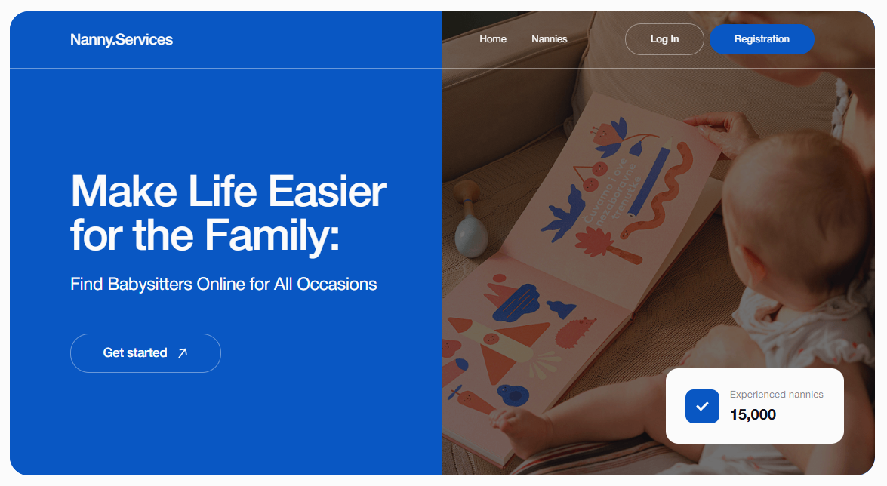
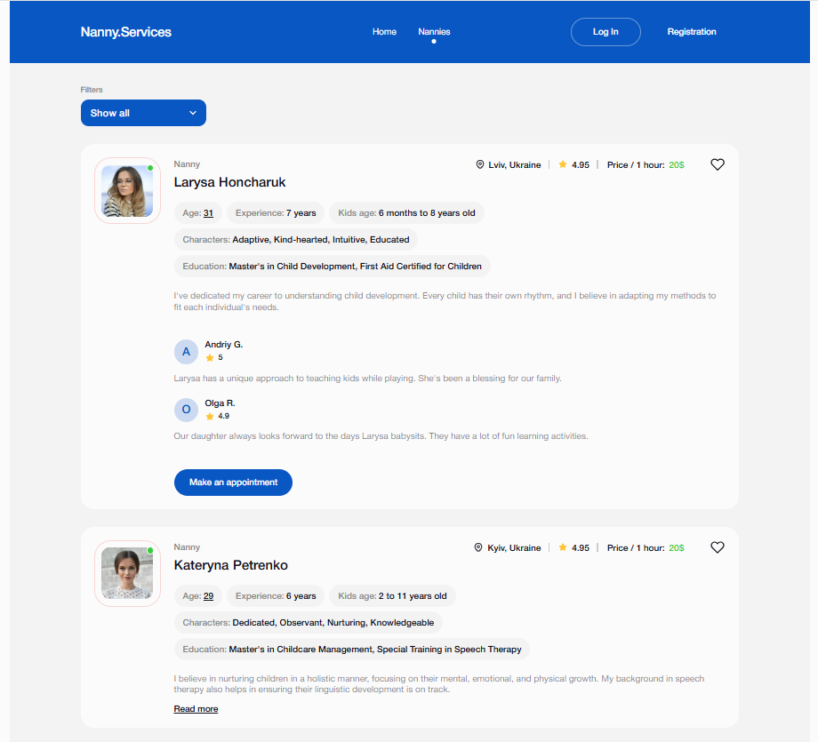

# 🧸 Nanny Services App

A web application for a company offering nanny services. Browse nannies, filter
them based on your needs, and save your favorites!

## 🖼️ Preview

  
  

## 🚀 Features

- **Home Page:** 👋 Introduction to the application with a catchy slogan and a
  call-to-action button leading to the "Nannies" page.
- **Nannies Page:** 👩‍👧‍👦 Explore a list of available nannies. You can:
  - **Sort:** Alphabetically (A-Z, Z-A), By popularity (lowest/highest rating).
  - **Filter:** By price range.
- **Favorites Page (Private):** ❤️ For logged-in users, view a collection of
  nannies you've added to your favorites.
- **User Authentication:** 🔑 Secure registration, login, fetching current user
  data, and logout functionalities powered by Firebase.
- **Data Management:** 🔥 Real-time interaction with a nanny collection using
  Firebase.

## 🛠️ Technologies Used

- **React:** ⚛️ JavaScript library for building user interfaces.
- **Vite:** ⚡ Next-generation frontend tooling for fast development.
- **React Router:** 🗺️ Declarative routing for React.
- **React Redux:** 📦 Predictable state management for React applications.
- **Redux Persist:** 💾 Persist and rehydrate your Redux store.
- **React Hook Form:** 📝 Performant and flexible form validation for React.
- **Yup:** ✅ Schema builder for value parsing and validation.
- **React Modal:** 🖼️ Accessible modal dialog component for React.
- **clsx:** ✨ A tiny utility for constructing `className` strings
  conditionally.
- **react-hot-toast:** 🍞 Elegant and simple toast notifications for React.
- **react-spinners:** ⏳ A collection of loading indicators for React.
- **React Icons:** 🖼️ Include popular icons in your React projects easily.
- **modern-normalize:** 🧼 Normalize browser defaults for consistent styling.
- **Vercel:** 🚀 Deployed and hosted on [Vercel](https://vercel.com/).

## 🔗 Live Demo

You can see the live application here:
[https://nanny-services-app-indol.vercel.app/](https://nanny-services-app-indol.vercel.app/)

## 📦 Setup Instructions

1. Clone the Repository: git clone
   https://github.com/your-repo/nanny-services-app.git

2. Navigate to the project folder: `cd nanny-services-app`

3. Install Dependencies: `npm install`

4. Run the development server: `npm run dev`

5. Open the app in your browser at http://localhost:3000

## 🖋️ Author

Mariia Ostapets, Fullstack developer

[LinkedIn](https://www.linkedin.com/in/mariia-ostapets/) |
[GitHub](https://github.com/Mariia-Ostapets)
